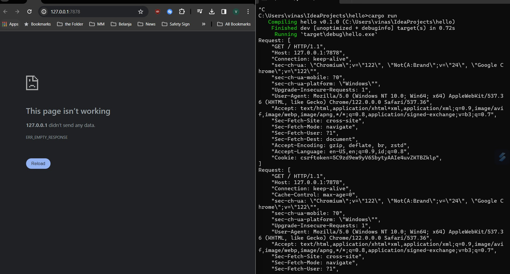
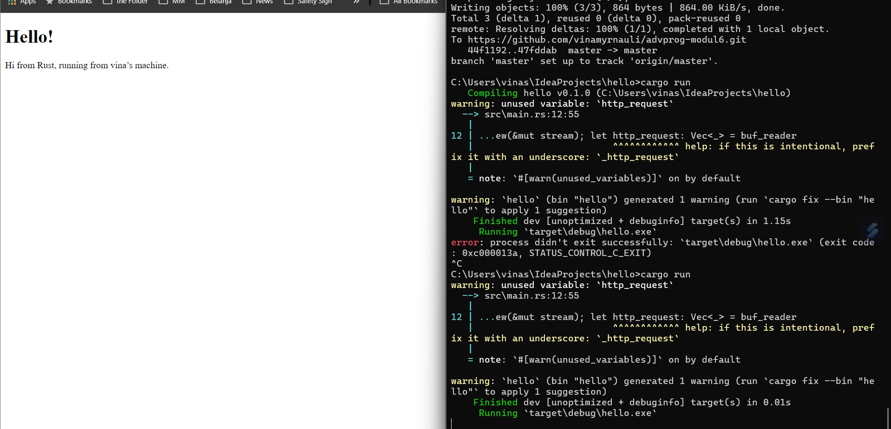
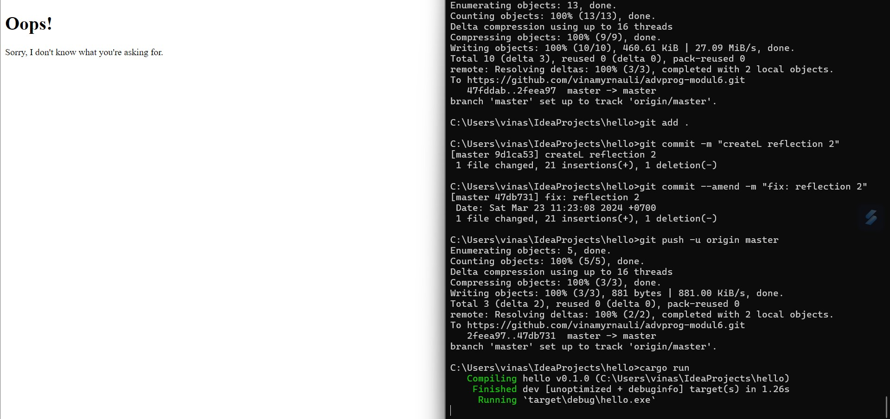

**Nama: Vina Myrnauli Abigail Siallagan** <br>
**NPM: 2206825776** <br>
**Kelas: Pemrograman Lanjut - A** <br>

## COMMIT 1
### **Apa yang `handle_connection` lakukan?**
1. Fungsi ini menerima referensi mutable ke `TcpStream` sebagai argumennya. Selanjutnya, ia membuat `BufReader` yang membungkus aliran TCP yang diberikan. Hal ini membantu dalam melakukan pembacaan yang telah di-*buffer* dari aliran dengan efisien.
2. `BufReader` membantu dalam pembacaan yang telah di-*buffer* dari aliran TCP, memastikan efisiensi dalam pengambilan data.
3. Selanjutnya, fungsi membaca baris-baris dari `BufReader` yang telah di-buffer sampai mencapai baris kosong. Baris kosong ini merupakan penanda akhir dari *header* permintaan HTTP, yang umumnya terjadi dalam format permintaan HTTP. Header biasanya diikuti oleh baris kosong sebelum badan pesan.
4. Setelah membaca baris-baris tersebut, fungsi mengumpulkannya menjadi sebuah vektor. Vektor ini merepresentasikan permintaan HTTP yang telah dibuat oleh klien.
5. Terakhir, `handle_connection` mencetak permintaan HTTP yang telah terkumpul untuk inspeksi lebih lanjut. Ini memungkinkan pengguna untuk melihat detail permintaan yang diterima oleh server untuk tujuan *debugging* atau analisis.

Jadi, `handle_connection` membaca aliran TCP masuk secara baris per-baris sampai menemukan baris kosong yang menandakan akhir dari header permintaan HTTP. Lalu, baris-baris yang telah terkumpul tersebut dicetak sebagai permintaan HTTP untuk inspeksi lebih lanjut.
<p align="center">
    
</p>

## COMMIT 2
### **Apa yang dilakukan oleh barisan tambahan kode `handle_connection`?**
1. Mengonfigurasi status_line yang menunjukkan bahwa respons HTTP adalah `200 OK`, yang artinya permintaan berhasil. 
2. Membaca isi dari file bernama `hello.html` menjadi sebuah string menggunakan `fs::read_to_string()`. Asumsinya bahwa ada file bernama `hello.html` dalam direktori yang sama dengan program yang berjalan. 
3. Menghitung panjang string isi file. 
4. Mengatur format respons HTTP, termasuk baris status, panjang konten, dan isi dari file hello.html. 
5. Menulis respons kembali ke aliran TCP, mengirimkannya kepada klien menggunakan `write_all()`.

Jadi, fungsi `handle_connection` yang dimodifikasi membaca konten dari file `hello.html`, membuat respons HTTP dengan status 200 OK, dan mengirimkannya kembali kepada klien melalui aliran TCP.
<p align="center">
    
</p>

## COMMIT 3
### Tahapan validasi *request* dan *selectively responding*
1. Saya membuat file `404.html` seperti berikut. 
```html
<!DOCTYPE html>
<html lang="en">
<head>
    <meta charset="utf-8">
    <title>Hello!</title>
</head>
<body>
<h1>Oops!</h1>
<p>Sorry, I don't know what you're asking for.</p>
</body>
</html>
``` 

2. Kemudian, saya memodifikasi fungsi `handle_connection` seperti berikut. 
```rust
fn handle_connection(mut stream: TcpStream) {
    let buf_reader = BufReader::new(&mut stream);
    let request_line = buf_reader.lines().next().unwrap().unwrap();

    if request_line == "GET / HTTP/1.1" {
        let status_line = "HTTP/1.1 200 OK";
        let contents = fs::read_to_string("hello.html").unwrap();
        let length = contents.len();

        let response = format!(
            "{status_line}\r\nContent-Length: {length}\r\n\r\n{contents}"
        );

        stream.write_all(response.as_bytes()).unwrap();
    } else {
        let status_line = "HTTP/1.1 404 NOT FOUND";
        let contents = fs::read_to_string("404.html").unwrap();
        let length = contents.len();

        let response = format!(
            "{status_line}\r\nContent-Length: {length}\r\n\r\n{contents}"
        );

        stream.write_all(response.as_bytes()).unwrap();
    }
}
```

3. Lalu, saya melakukan *refactor* pada fungsi `handle_connection` seperti berikut.
```rust
fn handle_connection(mut stream: TcpStream) {
    let buf_reader = BufReader::new(&mut stream);
    let request_line = buf_reader.lines().next().unwrap().unwrap();

    let (status_line, filename) = if request_line == "GET / HTTP/1.1" {
        ("HTTP/1.1 200 OK", "hello.html")
    } else {
        ("HTTP/1.1 404 NOT FOUND", "404.html")
    };
    let contents = fs::read_to_string(filename).unwrap();
    let length = contents.len();

    let response = format!(
        "{status_line}\r\nContent-Length: {length}\r\n\r\n{contents}"
    );
    stream.write_all(response.as_bytes()).unwrap();
}
```

4. Berikut adalah tampilan dari `404.html`.
<p align="center">
    
</p>

Fungsi `handle_connection` yang dimodifikasi berperan sebagai server HTTP yang sederhana. Ia membaca baris permintaan dari klien dalam permintaan HTTP dan memeriksa apakah itu merupakan permintaan `GET / HTTP/1.1`, yang menandakan permintaan untuk jalur *root* (/). Berdasarkan pemeriksaan ini, fungsi memberikan tanggapan dengan konten yang berbeda:

1. Jika permintaan adalah untuk jalur *root* (GET / HTTP/1.1), fungsi akan memberikan tanggapan dengan baris status `HTTP/1.1 200 OK`. Selanjutnya, ia membaca konten dari file bernama `hello.html`, menghitung panjangnya, membuat tanggapan HTTP yang berisi konten tersebut, dan mengirimkannya kembali ke klien.

2. Jika permintaan bukan untuk jalur *root* (menandakan bahwa sumber daya yang diminta tidak ditemukan), fungsi akan memberikan tanggapan dengan baris status `HTTP/1.1 404 NOT FOUND`. Kemudian, ia membaca konten dari file bernama `404.html`, menghitung panjangnya, membuat tanggapan HTTP yang berisi konten tersebut, dan mengirimkannya kembali ke klien.

Maka dari itu, fungsi `handle_connection` yang telah dimodifikasi ini menanggapi dengan konten yang berbeda berdasarkan permintaan yang diterima. Jika permintaan adalah untuk jalur *root*, server akan memberikan tanggapan dengan `hello.html`. Jika tidak, server akan memberikan tanggapan dengan halaman `404.html` yang menunjukkan bahwa sumber daya yang diminta tidak ditemukan.


